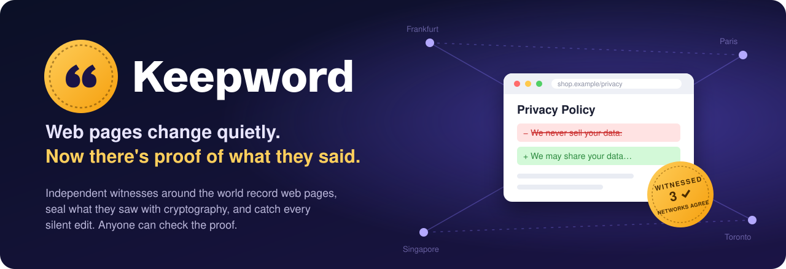
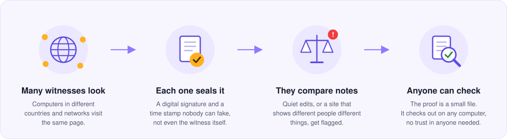

<p align="center">
  
</p>

<p align="center">
  <a href="https://github.com/Aelthorim/witness/releases/latest"></a>
  <a href="https://github.com/Aelthorim/witness/actions/workflows/ci.yml"></a>
  
  <a href="LICENSE"></a>
  
</p>

<p align="center">
  <b>Screenshots can be faked. Archives are run by one organization.<br>
  Witness is a network of independent witnesses whose records anyone can check.</b>
</p>

---

## Web pages don't keep their word

Paper stays the way it was printed. Web pages can be rewritten at any
moment, and the old version simply vanishes:

- 🔏 A company edits its **privacy policy** overnight. What it promised you
  yesterday is gone.
- 📰 A **news article** is quietly "updated", with no note saying what
  changed.
- 🏷️ A shop shows **one price to you** and another to someone in a
  different country.
- 🏛️ An **official page** disappears, and with it the commitment it made.

When that happens, how do you prove what the page said? A screenshot takes
ten seconds to fake. "I saw it with my own eyes" is your word against
theirs.

## Witness keeps the receipts

<p align="center">
  
</p>

Witness is a network of computers, called **witnesses**, run by different
people in different countries. Point them at a page you care about, and
they:

1. **Look.** Several witnesses on different networks fetch the page. They
   ignore the noise (ads, cookie banners, "posted 5 minutes ago") and keep
   what the page actually says.
2. **Seal.** Each witness signs what it saw and stamps it with the time,
   using public randomness from [drand](https://drand.love) and, a little
   later, the Bitcoin blockchain. Once sealed, a record can't be changed or
   backdated. Not by the website, not by you, not even by the witness that
   made it.
3. **Compare.** When a page changes without saying so, Witness flags it as
   a **silent edit** and shows exactly what changed. When witnesses in
   different places were shown different versions, it flags a **split**.
4. **Prove.** Any record can be exported as a small evidence file. Anyone
   can check it on their own computer, offline, without trusting Witness,
   the witnesses, or you.

## What it looks like

A privacy policy changes, and nothing on the page says so:

```diff
  Privacy policy
- We never sell your data.
+ We may share your data with partners.
```

Witness records it as a **silent edit**, and the proof checks out anywhere:

```text
$ witness verify --bundle evidence.json --esplora https://blockstream.info/api
  [ok  ] signature      signed by witness 7b757b5c…
  [ok  ] log inclusion  leaf 1187 of 1204
  [ok  ] cosignatures   tree head cosigned by 16 other witnesses
  [ok  ] not before     captured after 2026-05-01T09:14:03Z (drand round 5902114, 2s before the claimed time)
  [ok  ] anchor         tree head existed by Bitcoin block 947301
  [ok  ] body           41233 bytes, hash 4b768329a126
  ...
VERIFIED
```

## Why you can trust it

| You don't have to trust… | …because |
|---|---|
| **any single company** | Witnesses are run by independent people. A verdict only counts when witnesses on at least three different networks agree, so no single operator can fake one. |
| **anyone's promise** | Every record is signed and goes into a public, append-only log. Other witnesses check each log, so rewriting history gets caught, and the proof of it spreads to everyone. |
| **anyone's clock** | Public randomness proves a record wasn't made *before* a moment; Bitcoin proves it existed *by* a later one. |
| **Witness itself** | Evidence files check out on any computer, with no account, no server and no internet connection. |

## Who it's for

- **Journalists and fact-checkers:** "The article said X on Monday, and
  here's the proof."
- **Consumer groups and lawyers:** terms of service, prices and policies,
  exactly as they stood on a given day.
- **Researchers:** how the web changes, and who gets shown what.
- **Anyone** who has ever thought *"wait, that's not what it said
  yesterday."*

## What it isn't

- **Not an archive of the whole web.** The Internet Archive does that, and
  does it well. Witness records the pages people choose to watch, and
  proves what they said without asking anyone to trust one organization.
- **Not a lie detector.** It proves what a page *said* and *when*, not
  whether it was *true*.
- **Not finished.** Version 1.0 works end to end, and the network is just
  starting. Using it currently means running a small server and typing a
  few commands; friendlier ways in are on the way.

## Get involved

- ⭐ **Star the repo** to follow along.
- 🖥️ **Run a witness.** The network gets stronger with every witness in a
  new country or network. One command sets up a server:
  [docs/NETWORK.md](docs/NETWORK.md).
- 🔍 **Watch a page that matters to you.** Install a node and ask the
  network to keep an eye on it.
- 🛠️ **Build with us.** Everything is in Rust, tested end to end, and
  documented in [docs/DESIGN.md](docs/DESIGN.md).

<details>
<summary><b>Questions people ask</b></summary>

**Do I need to be technical?**
Today, running a witness takes a Linux server and a terminal, but setup is
a single command. Checking a proof takes the `witness` program. A simpler
way for everyone is on the roadmap.

**What does it cost?**
The software is free and open source (AGPL-3.0). A witness runs happily on a small cloud server that
costs a few euros a month.

**Does it track people?**
No. Witnesses only fetch public pages that someone asked them to watch.
They don't collect anything about visitors.

**What if a witness lies?**
Its record would disagree with the others, and the network notices. A
witness that shows different histories to different people produces
cryptographic proof against itself, and the network stops trusting it.

**Can a website stop it?**
A site can block witnesses, but that's visible too. And a site that shows
witnesses in one country a different page than in another gets flagged
for exactly that.

**Is it legal?**
Witnesses fetch public pages, like a browser does. Operators choose what
their witness keeps and shares; by default it shares only fingerprints
(hashes), never page content. See [DESIGN.md §7](docs/DESIGN.md#7-storage-retention-and-law)
for the details, and check your local law before running a public witness.

</details>

---

# For the technically curious

A Witness node fetches a URL, reduces it to its meaningful content, signs a
statement about what it saw, and appends that statement to a
Certificate-Transparency-style Merkle log. It keeps watching, and when the
page changes it tells you what changed and whether the publisher said so.
Every record can be exported as a self-contained **evidence bundle** that
anyone can verify offline, without trusting the node.

Witnesses federate: each log is audited by 16 others, which check its
checkpoints with consistency proofs and cosign them. Watch requests are
assigned by public randomness, witnesses corroborate each other's network
location, and they compare what they saw. When independent networks see
different content at the same moment, the network raises a split alert.
Captures carry a drand beacon, which proves they happened *after* a point
in time. Logs are anchored in Bitcoin through OpenTimestamps, which proves
the captures existed *before* a later point.

The design, threat model and formats are in [docs/DESIGN.md](docs/DESIGN.md).

## Install

On a server (Debian, Ubuntu, Fedora, RHEL-likes, Arch, openSUSE, Alpine):

```sh
git clone https://github.com/aelthorim/witness.git && cd witness
sudo sh scripts/install.sh --domain witness.example.org --caddy
```

This builds Witness, creates a sandboxed `witness` service with its own user,
fetches the IP-to-ASN table and refreshes it weekly, detects the node's
network, and puts the peer API behind Caddy with automatic TLS. Re-run it to
upgrade. Prebuilt static Linux binaries of the `witness` command (x86_64 and
arm64) are attached to each [release](https://github.com/Aelthorim/witness/releases);
changes are listed in [CHANGELOG.md](CHANGELOG.md). There is also a
container image (`Dockerfile`,
`packaging/docker/compose.yaml`). Both are described in
[docs/INSTALL.md](docs/INSTALL.md). To start a network or join one, see
[docs/NETWORK.md](docs/NETWORK.md).

## Quick start (from source)

```sh
cargo build --release
alias witness=./target/release/witness

witness init --asn 3320 --country DE        # creates ./witness-data
witness capture https://example.org/privacy
witness watch add https://example.org/privacy --every 6h
witness serve --watch                        # web UI on http://127.0.0.1:8480
```

When the page changes:

```
$ witness capture https://example.org/privacy
attestation 7c1e…
  ...
CHANGED since 3f2a90c1b7d4: silent edit: +1 -1 lines

--- before
+++ after
@@ -3,4 +3,4 @@
 h1: Privacy policy
-p: We never sell your data.
+p: We may share your data with partners.
```

Proving it to someone else:

```sh
witness export https://example.org/privacy --at 2026-05-01 -o evidence.json
# they run, with no node and no network:
witness verify --bundle evidence.json
```

```
  [ok  ] signature      signed by witness 7b757b5c…
  [ok  ] tree head      size 1204 root 3fc10f581373
  [ok  ] log inclusion  leaf 1187 of 1204
  [ok  ] headers        467 bytes, hash 13d3817dd54e
  [ok  ] body           41233 bytes, hash 4b768329a126
  [ok  ] normalized     matches 61a162ac8062
  [ok  ] renormalize    body normalizes to the attested norm hash

VERIFIED
```

## Commands

| Command | What it does |
|---|---|
| `init [--asn N] [--country CC] [--retain full\|normalized\|none]` | Create key, config and empty log |
| `id` | Show witness key and log head |
| `capture URL [--render]` | Fetch now, attest, log, compare with the previous capture |
| `verify URL\|ID [--at TIME]` / `verify --bundle FILE` | Run every check on a stored capture or a bundle |
| `export URL\|ID [--at TIME] [--no-content] [-o FILE]` | Write an evidence bundle |
| `warc URL\|ID -o FILE` | Rebuild a WARC 1.1 file for a capture |
| `history URL` | All captures and detected changes |
| `diff URL` / `diff ID ID` | Diff the last two versions, or two captures |
| `watch add\|rm\|list\|run [--once]` | Manage and run the watchlist |
| `log head\|consistency OLD [NEW]\|audit` | Tree head, consistency proofs, full self-audit |
| `purge URL [--forget]` | Erase stored content (and records); the log stays valid |
| `serve [--addr A] [--api-addr B] [--watch] [--anchor]` | Web UI (private), peer API (public), scheduler, federation and anchoring loops |
| `net add-peer URL\|remove-peer KEY\|peers\|sync\|status\|lookup IP` | Federation with other witnesses; `status` warns about misconfiguration |
| `request URL [--every 1h] [--for 7days]` / `request URL --cancel` | Ask the network to watch a URL (asking again replaces the request), or withdraw it |
| `requests [--mine]` | Active network watch requests |
| `verdict URL` | What independent witnesses agree the URL served |
| `alerts` | Split, silent-edit and equivocation alerts |
| `anchor submit\|upgrade\|list\|export` | Bitcoin anchoring via OpenTimestamps |
| `beacon [ROUND]` | Fetch and verify a drand beacon |
| `config show\|get\|set\|unset` | Read or change `witness.toml`, with validation |

`--at` takes RFC 3339 or `YYYY-MM-DD` (end of that day, UTC). IDs can be
abbreviated. `--json` gives machine-readable output.

The node's data directory is `--dir` or `WITNESS_DIR` if given, else
`./witness-data` if it exists, else the node the installer set up
(`/var/lib/witness`). Run as root, `witness` switches to the owner of that
directory, the service user, before doing anything, so `sudo witness …`
just works on an installed node.

## Configuration

`witness-data/witness.toml`; see [docs/witness.example.toml](docs/witness.example.toml).
The important settings:

- `content.retain`: what to keep. `full`, `normalized` (diffs without raw
  bytes) or `none` (hashes only). Attestations and the log never contain
  page content.
- `[[rules]]`: per-site normalization (extra elements to drop, content
  root). Rules are part of the normalizer profile each attestation commits
  to.
- `capture.use_system_proxy`: off by default. A proxy changes your vantage
  point, and a TLS-intercepting one hides the server's certificate.

## Running in a network

```sh
witness init --asn 3320 --country DE
# in witness-data/witness.toml:
#   [network]  endpoint = "https://witness.example.org"   peers = ["https://other.example"]
#   [quorum]   asn_db = "/var/lib/witness/ip2asn-combined.tsv"   (from iptoasn.com)
witness serve --api-addr 0.0.0.0:8481 --watch --anchor
```

Put the API (`/v1/...`) behind TLS on your public endpoint. Keep the web UI
(`--addr`, default `127.0.0.1:8480`) private, because it shows page content.
Peers corroborate each other's location from the addresses they see pushes
come from. Verdicts only count witnesses whose ASN is corroborated this
way, so every node needs an IP-to-ASN table.

## TLSNotary proof tier

For high-value pages, a second witness can notarize the TLS session itself
(MPC-TLS via [TLSNotary](https://tlsnotary.org)). Then even the capturing
witness couldn't have made the content up on its own:

```sh
cd crates/witness-tlsn          # separate workspace, Rust 1.95+
cargo build --release
witness-tlsn serve --addr 0.0.0.0:8482                    # on the notary
witness-tlsn capture https://example.org/terms --verifier notary.example.net:8482 --verifier-key <hex>
```

Bundles then carry the notary's receipt and the transcript, and
`witness verify` checks both.

## Headless rendering

For pages that only exist after JavaScript runs:

```sh
cargo build --release --features render
witness capture --render https://example.org/app
```

This needs Chrome or Chromium; set `capture.chrome` if it isn't on `PATH`.
The browser resolves hosts itself, so the private-address guard only covers
the page's own address, not its sub-resources. Only render URLs you chose;
network requests are rendered only with `network.render_requests`.

## Layout

```
crates/witness-core       protocol: encoding, attestations, Merkle log, bundles, assignment, quorum
crates/witness-normalize  canonicalizer, site rules, diff and silent-edit classifier
crates/witness-capture    HTTP capture, SSRF guard, headless render, WARC export
crates/witness-store      blob store, SQLite index, log, watchlist
crates/witness-node       the `witness` binary: CLI, peer API, federation, web UI
crates/witness-tlsn       TLSNotary proof tier (separate workspace)
docs/DESIGN.md            threat model, formats, network design, roadmap
docs/INSTALL.md           production installation (installer, container)
docs/NETWORK.md           starting or joining a public witness network
scripts/install.sh        the installer
packaging/docker/         container entrypoint and compose file
```

## Development

```sh
cargo test --workspace
cargo clippy --workspace --all-targets --all-features -- -D warnings
cargo fmt --all --check
```

Integration tests run everything over real HTTP on localhost:

- `e2e.rs`: the single-node lifecycle (capture, noise, silent and disclosed
  edits, bundles, tampering, redirects, audit, erasure)
- `network.rs`: four witnesses in four ASNs (discovery, log audits,
  cosigning, observation receipts, assigned watch requests, replacing and
  withdrawing them, dropping gossip from strangers, a cloaking server
  producing a split verdict and alert, equivocation detection), and a
  six-node network with one-peer gossip samples and two auditors per log
- `anchoring.rs`: drand beacons and Bitcoin anchoring against mock drand,
  OpenTimestamps and Esplora services
- `witness-normalize/tests/corpus.rs`: the normalizer regression corpus
- `witness-tlsn/tests/notary.rs`: a full MPC-TLS notarization between two
  witnesses against TLSNotary's test server

## License

Witness is free software under the [GNU Affero General Public License
v3.0](LICENSE). You may use, study, change and share it. If you run a
modified version as a service for others, you must offer them its source
code under the same license.
